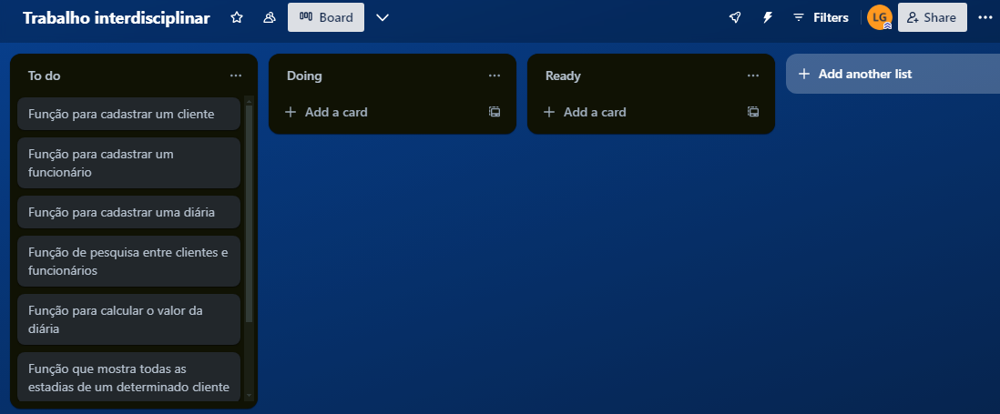
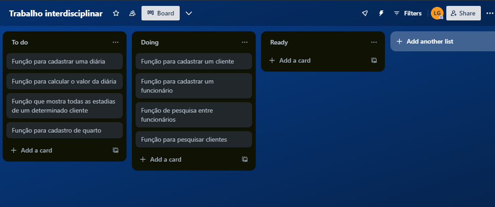
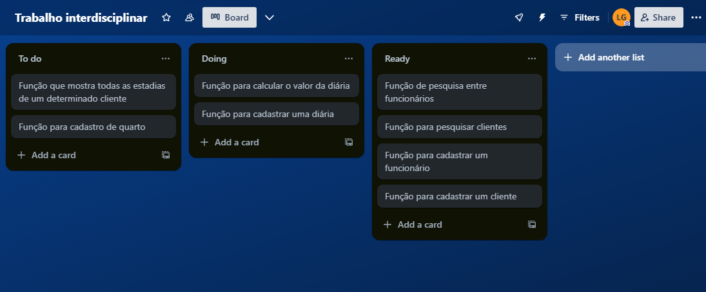
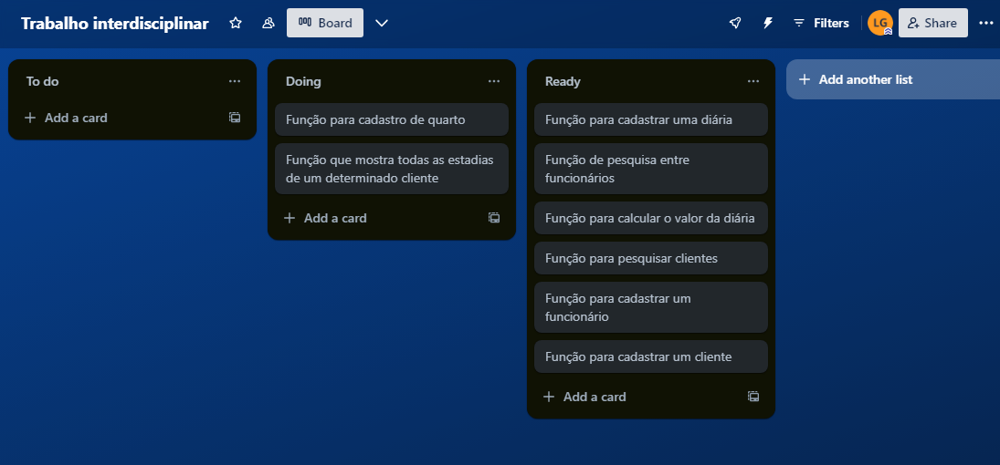

# **Pontifícia Univerdade Católica de Minas Gerais**

**Instituto de Ciências Exatas e Informática**

**Unidade Educacional Coração Eucarístico**

## Enzo Casaes e Luiz Gontijo 

## Sistema do Hotel Descanso garantido 

**Introdução**

O Software foi desenvolvido para substituir as planilhas que deixavam confusas as tarefas de controle de estadia e cadastro de pessoas (clientes e funcionários). 

**Backlog do produto**

incialmente o produto necessitava dessas 6 funções que estão explicitadas na iamgem, mas com o decorrer do processo, a dupla sentiu a necessidade da adição de duas funções complementares ( Cadastro do quarto e a divisão entre pesquisa de clientes e funcionários). O quadro foi organizado pelo Trello. 

 

A imagem acima mostra a sprint 1, que deveria ter sido realizada até o dia 19/06/2024

 

A imagem acima mostra a sprint 2, que deveria ter sido realizada até o dia 22/06/2024

A imagem acima mostra a sprint 3, que deveria ter sido realizada até o dia 24/06/2024. Essa sprint foi a última realizada pela dupla, após isso o sistema começou a passar por uma fase de testes gerais e, não de cada função separadamente, como havia sendo feito. 

**Lista de assinatura das funções e parâmetros**

**TESTES**
Caso de teste 1- Cadastro de cliente: Entrada de dados: 999/ Pedro/ Rua 133/ 319999. Saída de dados esperada: Cliente cadastrado com sucesso. Resultado: funcionando! 

Caso de teste 2- Cadastro de um código de cliente repetido: Ao cadastrar cliente, colocar um código que já tenha sido cadastrado. Entrada de dados: 999. Saída de dados: O código já está cadastrado!. Resultado: funcionando!

Caso de teste 3: Cadastrar funcionário: Entrada de dados: 999/ Artur/ Chofer/ 3199/ 1500. Saída de dados: Funcionário cadastrado com sucesso!. Resultado: funcionando!

Caso de teste 4- Cadastro de um código de funcionário repetido: Ao cadastrar funcionário, colocar um código que já tenha sido cadastrado. Entrada de dados: 999. Saída de dados: O código já está cadastrado!. Resultado: funcionando!

Caso de teste 5- Cadastro de quarto: Entrada de dados: 999/ 4/ 300/ desocupado. Saída de dados: Quarto cadastrado com sucesso. Resultado: Funcionando!

Caso de teste 6: Cadastro de um código de quarto repetido: Ao cadastrar quarto, colocar um código que já tenha sido cadastrado. Entrada de dados: 999. Saída de dados: O número do quarto já está cadastrado!. Resultado: funcionando!

Caso de teste 7: Cadastro de estadia de um cliente não cadastrado: Entrada de dados: 999/999. Saída de dados: O cliente não está cadastrado. Resultado: Funcionando!

Caso de teste 8: Cadastro de estadia: Entrada de dados: 9000/999/4/"26/10/2005"/"29/10/2005". Saída de dados: Estadia cadastrada com sucesso. Resultado: Funcionando!

Caso de teste 9: Baixar estadia: Entrada de dados: 999. Saída de dados: 150 reais. Resultado: Funcionando!

Caso de teste 10: Cadastrar estadia antes de cadastrar um quarto: Entrada de dados: 9000/999/4. Saída de dados: Não tem quarto disponível com essa descrição. Resuldado: Funcionando!

Caso de teste 11: Cadastrar estadia antes de cadastrar um cliente: Entrada de dados: 9000/999. Saída de dados: Cliente não cadastrado. Resultado: Funcionando!

Caso de teste 12:
